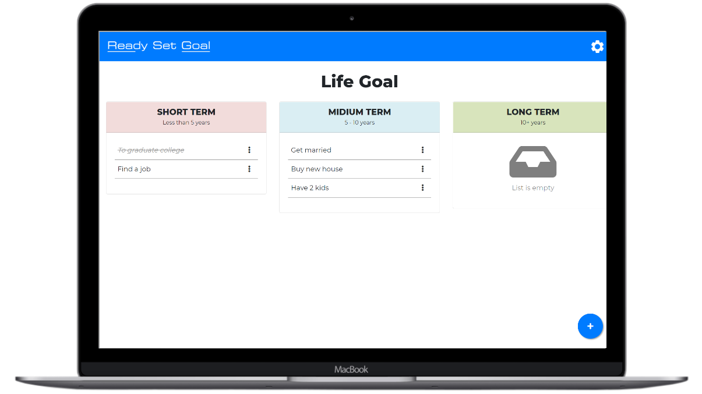

# Ready Set Goal App

This is application was made using javascript and lowDB for local storage. Each user can retrieve their own listed goal.

## Live Link

You can see the live demo of the website here:

[(https://cjlacaste28.github.io/ready-set-goal/)](https://cjlacaste28.github.io/ready-set-goal/)

# 

## Technologies

- HTML
- CSS
- Bootstrap
- lowdb
- SweetAlert2
 
## Resources Used 

- [Login/Register Template](https://codepen.io/FlorinPop17/pen/vPKWjd)
- [Form Validation](https://codepen.io/FlorinPop17/pen/OJJKQeK)
 
## Author
 
 * [Christian Lacaste](https://christianlacaste.me/)
